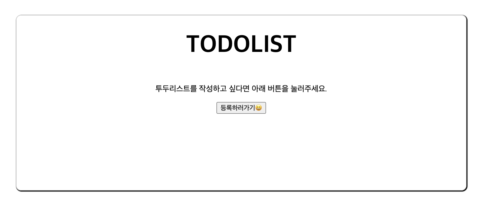

# 간단한 TODOLIST

리액트를 사용하여 구현된 간단한 TodoList 애플리케이션입니다.

### 사용된 라이브러리 및 도구

React: 사용자 인터페이스를 구축하기 위한 JavaScript 라이브러리
React DOM: 웹 애플리케이션의 최상위에서 사용할 수 있는 DOM 관련 메서드를 제공
Webpack: 현대 JavaScript 애플리케이션을 위한 정적 모듈 번들러
Babel: 차세대 JavaScript를 사용할 수 있게 해주는 JavaScript 컴파일러
ESLint: JavaScript 코드의 문제를 식별하고 수정하기 위한 도구
Prettier: 코드 포맷터
